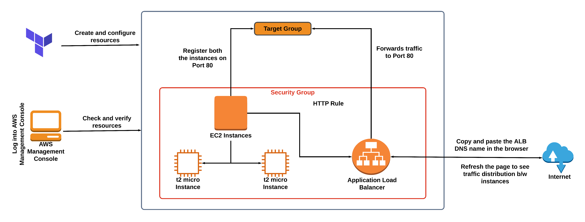

# Create-an-Application-Load-Balancer---incoming-traffic--EC2-Instances--Terraform
Create an Application Load Balancer to distribute the incoming traffic between two EC2 Instances using Terraform

Architecture Diagram :

> #### Terraform commands 
>
> - terraform init 
> - terraform plan
> - terraform apply
> - terraform destroy
